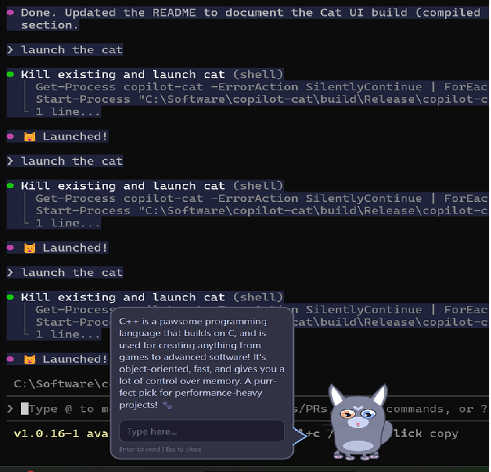
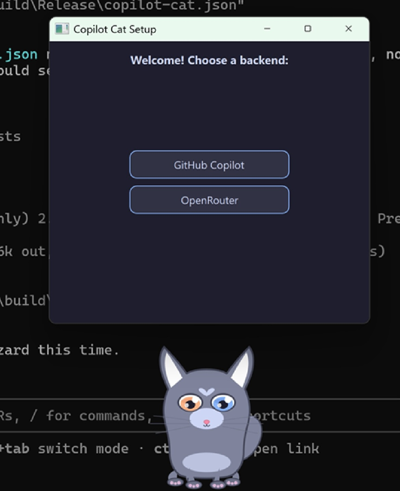

# copilot-cat

Desktop pet cat that serves as a visual interface for GitHub Copilot via MCP.



## Build

### Cat UI (compiled C++ exe)

```powershell
cmake -B build -G "Visual Studio 17 2022" -A x64 -DCMAKE_PREFIX_PATH=C:/Qt/6.8.3/msvc2022_64_static -DQT_STATIC=ON
cmake --build build --config Release
```

Produces a single exe (`build\Release\copilot-cat.exe`) with Qt linked statically. On first launch a setup wizard guides you through backend configuration (GitHub Copilot or OpenRouter).



### MCP Server (Node.js)

```powershell
npm install
npm run build
```

## MCP config

Use a direct launcher in your MCP config. Do not use `npm start`, `npx`, or any package-manager wrapper for an MCP server command because MCP requires clean stdio.

Windows example:

```json
{
  "servers": {
    "copilot-cat": {
      "command": "C:\\Software\\copilot-cat\\scripts\\copilot-cat-mcp.cmd"
    }
  }
}
```

Alternative Windows example using Node explicitly:

```json
{
  "servers": {
    "copilot-cat": {
      "command": "C:\\Program Files\\nodejs\\node.exe",
      "args": ["C:\\Software\\copilot-cat\\dist\\server.js"]
    }
  }
}
```

Unix example:

```json
{
  "servers": {
    "copilot-cat": {
      "command": "/path/to/copilot-cat/scripts/copilot-cat-mcp"
    }
  }
}
```

## Troubleshooting

- If Copilot CLI stays on "Loaded 1 MCP server(s)", the server command is usually wrong or wrapped by `npm`/`npx`.
- The MCP process must write only MCP protocol messages to stdout. This server writes logs to stderr only.
- Build output must exist at `dist/server.js` before launching the server.

## Plugin

copilot-cat is available as an agency plugin. Once installed, say **"become a cat"** and the desktop cat launches automatically with the MCP server connected.

See [`plugin/README.md`](plugin/README.md) for full installation and usage details.

### Plugin structure

```
plugin/
├── .claude-plugin/plugin.json   # Marketplace manifest
├── agency.json                  # Engine targeting (Copilot)
├── agents/cat-companion.md      # "become a cat" agent
├── skills/launch-cat/SKILL.md   # Launch orchestration
├── config.md                    # Paths, ports, protocol reference
└── README.md                    # User-facing docs
```